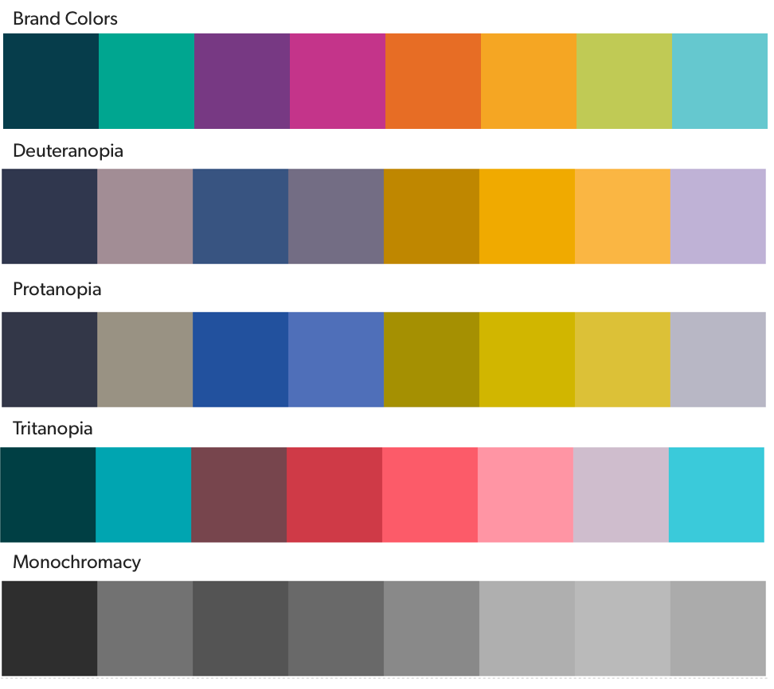

Aperture provides a spectrum of colors that
* align with Bazaarvoice brand colors
* align to semantic meaning
* align to consistent, meaningful usage

Our color spectrum is based on Bazaarvoice brand palette, but is geared toward semantic meanings and accessible usage of color. Our colors should only be used with sufficient color contrast (see Accessibility - Contrast) between text and background. When using Brand Colors for charts and graphs, please consult our Charting Color guidance. For very specific semantic usage of color, reference our Design Tokens.

## Aperture Colors
### Brand Colors
```color
name: BV_NAVY (BLUE_5)
color: #063D4B
```
```color
name: BV_TEAL (TEAL_3)
color: #00A690
```
```color
name: BV_PURPLE
color: #773983
```
```color
name: BV_MAGENTA
color: #C4348A
```
```color
name: BV_ORANGE
color: #E76D25
```
```color
name: BV_GOLD
color: #F5A623
```
```color
name: BV_LGREEN
color: #C0CA55
```
```color
name: BV_SKY
color: #65C8CF
```

### Color scales
#### Greyscale
```color-palette
GREY_1, #fff
GREY_2, #fafafa
GREY_3, #ededed
GREY_4, #ccc
GREY_5, #999
GREY_6, #717171
GREY_7, #222
```
#### Blues
```color-palette
BLUE_1, #EBFBFF
BLUE_2, #B3E4F1
BLUE_3, #0C7994
BLUE_4, #09596E
BLUE_5, #063D4B
```
#### Teals
```color-palette
TEAL_1, #F2FBFA
TEAL_2, #93E0D6
TEAL_3, #00A690
TEAL_4, #00806F
TEAL_5, #005449
```
### Semantic color scales
#### Success
```color-palette
PINE, #296300
KELLY, #388700
WASABI, #85BF5B
MINT, #EEFAE6
```
#### Warning
```color-palette
CHOCOLATE, #724D0E
GOLD, #F5A623
CARAMEL, #FFD899
SAND, #FFF5E5
```
#### Error
```color-palette
BRICK, #99281C
ROSEBUD,#FFB2AA
BLUSH, #FFF6F5
```


## Accessibility Contrast
Usage of color is generally defined by semantic color naming (see Design Tokens), but [contrast between text and background](../contrast-grids) should always be checked. Aperture requires at least WCAG AA contrast levels for small text. 

### Text sizes
According to the WCAG 2 guidelines, Large text is ~18.62px Bold or 24px Regular and above. Normal text is generally anything under this size (without going too small - update this with specifics from WCAG 2.1).

> But WCAG says 18pt Regular or 14pt Bold!

Notice the units… ``pt`` is a Point, and we're talking in Pixels (``px``). **1pt ⋍ 1.33px** (cf. [Paciello Group: What's large text in wcag 2 parlance?](https://developer.paciellogroup.com/blog/2012/05/whats-large-text-in-wcag-2-0-parlance/))

## Charting Color
Color usage in charts and graphs should be tested for contrast and differentiability in both CVD[^1] (types of color blindness) and monochromacy (basically, how it might look printed on a B&W laser printer). Our brand colors were not chosen for optimal contrast among each other… choose wisely. Tints and shades of our brand colors can be used to provide contrast, and texture can also be used to help differentiate color (see Brand Style Guide for examples of defined BV textures).




 [^1]: Color Vision Deficiency