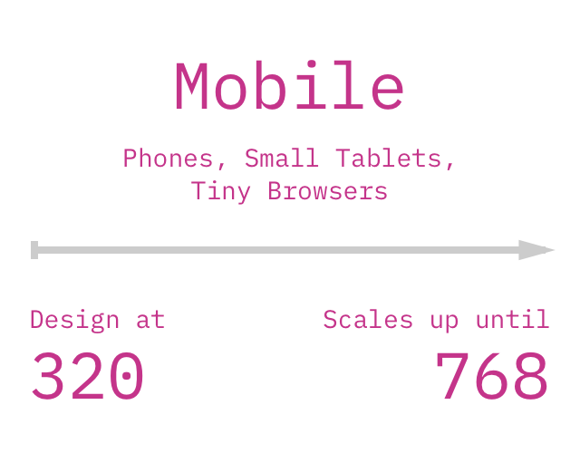
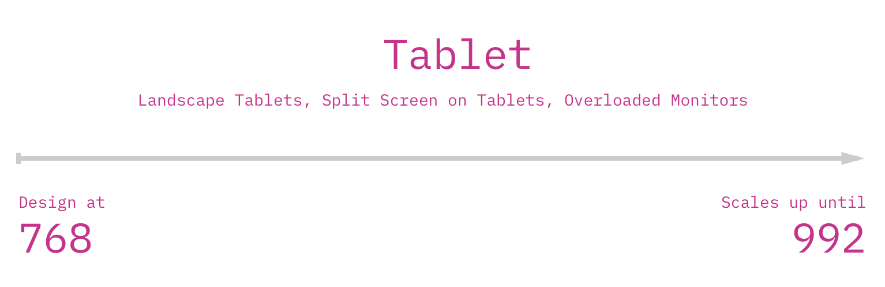
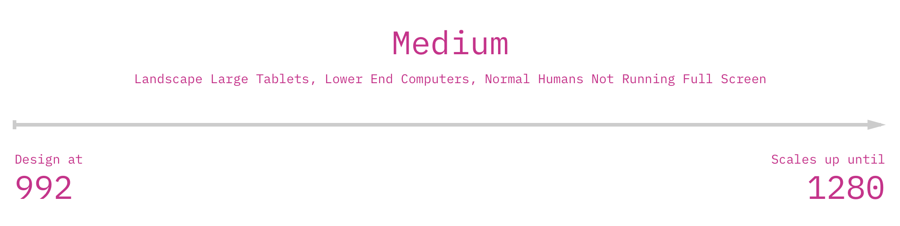
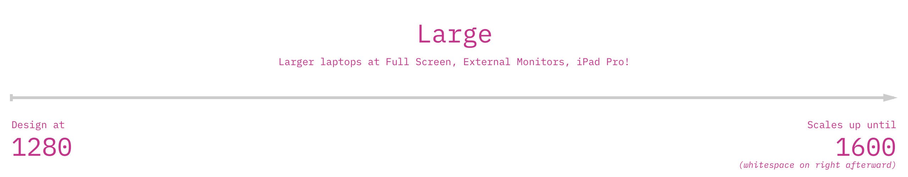
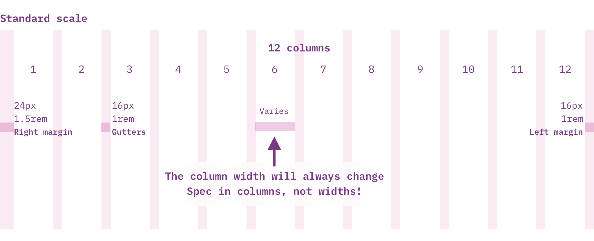
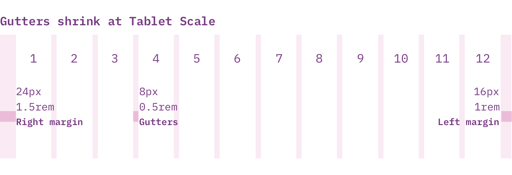
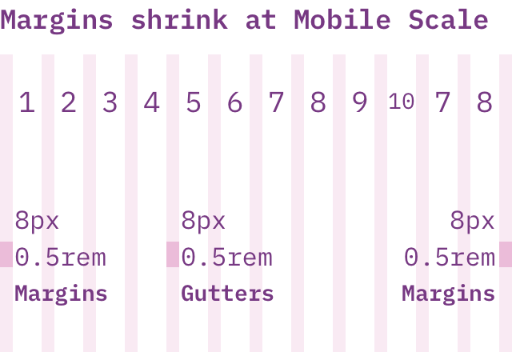
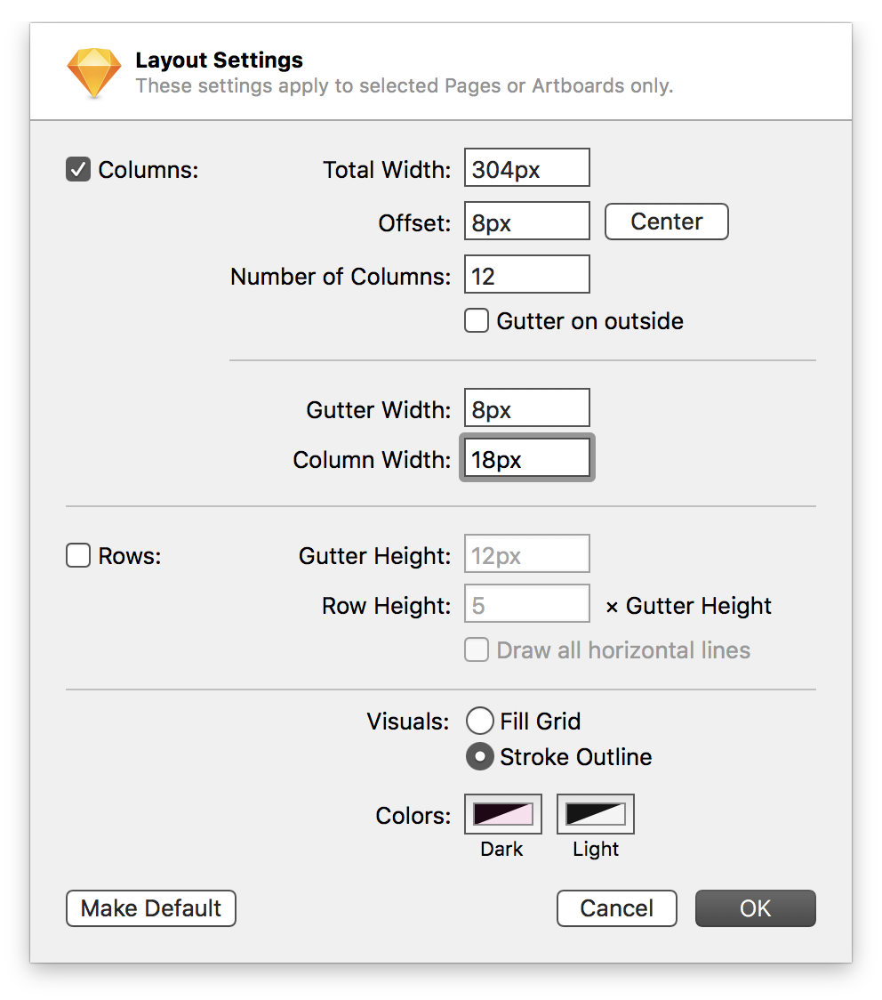
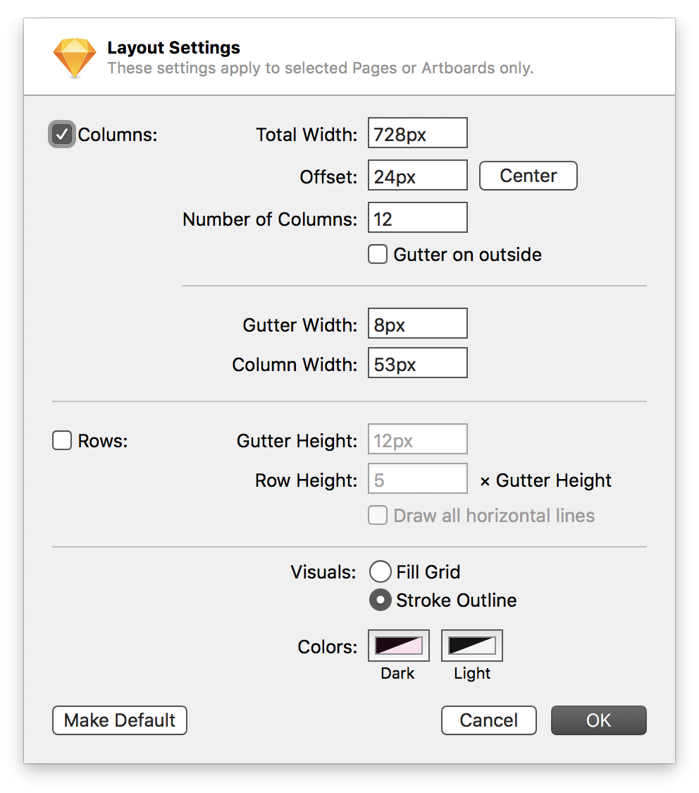

Page [Content](../) is designed and uses layouts based on a responsive grid system, with 4 main scopes:

### Mobile (Extra Small): *320px to 768px*

<small><em>Mobile scope is currently in review, and should be considered, but is not required as a deliverable at this point. Mobile-first design helps simplify page complexity, and while not currently required, we should start small and build up. Some feature usage may not lend itself to full mobile friendliness; it is important that we identify these feature gaps and plan official support around it.</em></small>

### Tablet (Small): *768px until 992px*

### Medium: *992px until 1280px*

### Large: *1280px until 1600px*

## Examples
### Standard grid

### Tablet grid

### Mobile grid

## Usage
* There are touch interfaces at ALL these breakpoints. We will investigate ``pointer:coarse`` css (https://css-tricks.com/touch-devices-not-judged-size/), but design for touch regardless.
Other than outside margin and scale guidelines, Portal Header and Footer are unbound by the Grid.
* Minimum supported width is 320px (20rem).
* Large Scope has a max-width of 1600px (100rem), after which the grid no longer scales with the viewport width (vw) and remains left-aligned, adding white space to the right margin.
* Fixed values are always based on our Scale (units of 4), but column values are fluid to the size of the viewport.
* Gutters are 8px/0.5rem in smaller scopes, 16px/1rem in larger scopes.
* The 24px/1.5rem left and 16px/1rem right margins are consistent, aside from Mobile, where they collapse to 8px/0.5rem each.
* Do not spec values to a specific width. Instead, use column values.
* Individual components should be built to scale and adapt based on column size and breakpoints. Larger scale items may shrink to become roughly the same size, and should consider identical styling at Mobile scope.
* Sub-sections in Content can adhere to their own breakpoints as well… this is encouraged! Don't force your workflow to fit if it needs to have a breakpoint based on an optimal size for an element on your page. You might need a breakpoint on a video that happens midway between two Content breakpoints… do it. This is just the core layout of the page.

### Building Artboards and Layout / Grid guides in Sketch
#### 320px artboard
* Total width of content: 320(vw)-8(margin-left)-8(margin-right) = 304px
* Offset: 8px
* Number of Columns: 12
* No Gutter on outside
* Gutter Width: 8px
* Column Width: (should auto calculate)

#### 768px artboard
* Total width of content: 768(vw)-24(margin-left)-16(margin-right) = 728px
* Offset: 24px
* Number of Columns: 12
* No Gutter on outside
* Gutter Width: 8px
* Column Width: (should auto calculate)

#### 992px artboard
* Total width of content: 992(vw)-24(margin-left)-16(margin-right) = 952px
* Offset: 24px
* Number of Columns: 12
* No Gutter on outside
* Gutter Width: 16px
* Column Width: (should auto calculate)

#### 1280px artboard
* Total width of content: 1280(vw)-24(margin-left)-16(margin-right) = 1240px
* Offset: 24px
* Number of Columns: 12
* No Gutter on outside
* Gutter Width: 16px
* Column Width: (should auto calculate)

### Setting a grid in Sketch using the Layout feature
1. View > Canvas > Layout Settings…
2. Enter values based on Artboard sizes above