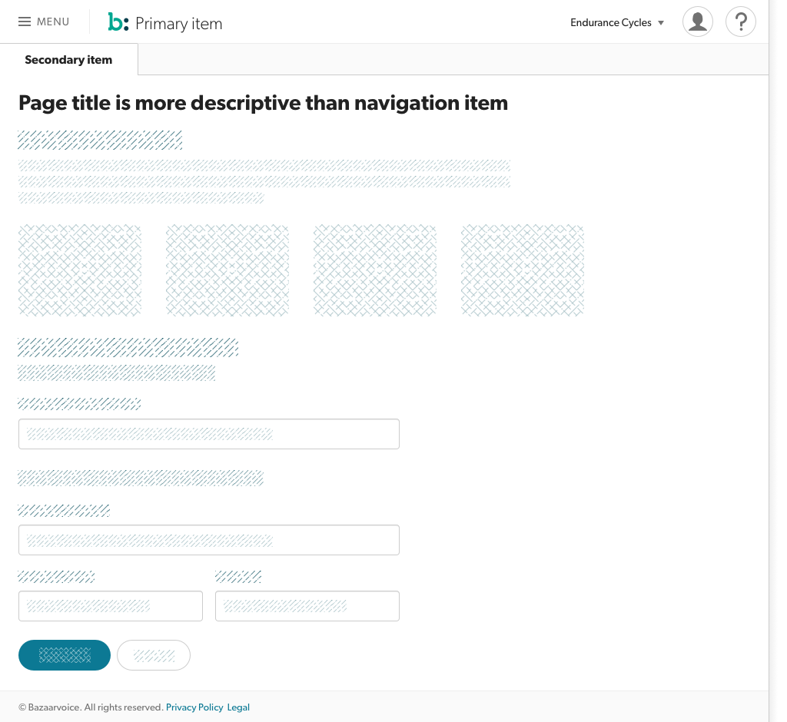

## Description
**Page Content** is the main workflow area of the page, beginning directly after the [Page Header](../header), and ending at the at the [Page Footer](../footer). It contains the data and actions for the majority of user tasks and workflows.

## Example

##Usage
* The Page Title is the first element in the Content, directly after the [Page Header](../header) ends.
* Data, buttons, and actions on the data contained in the page live within Page Content. Only navigational or [global actions](../header/globalactions) live outside of Page Content.
* Page Content may not behave in a way that obfuscates or makes the content of [Page Footer](../footer) unreachable.
* Page Content may temporarily obfuscate or block all other sections of the page with a Modal Popover, following the component's associated rules.
* Page Content is displayed on a white background. Sections or Elements may have different (accessible) background colors in alignment with color guidelines, but all live conceptually above a white background.
* All components contained within Page Content must follow the guidelines given for each. Please consult with the Aperture team if you feel a necessary type is missing.
* All pages of Page Content should lay out using the [Aperture Grid](grid). Standard components for Page Content are designed to adhere to Aperture Grid sizing automatically.
* Inserting non-Console pages into Page Content via an iFrame is discouraged. Specific 3rd-party components and data displays may be used if approved by the Client Tools team. Our data should be displayed using our tools and technology whenever possible.
* See [Aperture Grid](grid) for specifics on supported viewport sizes.