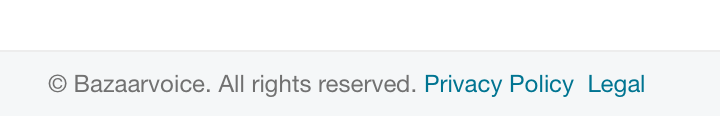

## Description
The **Footer** is the grouping directly following [Content](../content), containing copyright, and [Privacy Policy](http://www.bazaarvoice.com/privacy-policy) and [Legal](http://www.bazaarvoice.com/legal) links. Included on every page. 

## Example

##Usage
* **Footer must always be available and reachable on every page.** If a page layout or loading mechanism (infinite scrolling, lazy-loading, scrolling panels) causes the Footer to move from its normal position (left-aligned at the end of Content), the page must implement a Footer fixed to the bottom of the Viewport, with no elements covering, obscuring, or hindering a user's ability to read and access the links contained therein.
* Links within Footer are controlled by Client Tools Team in alignment with legal requirements.
