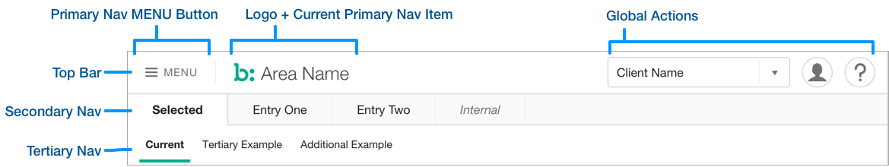

## Description
The Header is the immediate first grouping of elements on a page, including the Top Bar, Secondary Navigation, and the Global Actions. Tertiary Navigation is an optional element in the Header.

## Example

### Top Bar
The first group in the Header, housing the [Primary Navigation](primary-nav) MENU button, BV Logo and currently selected Primary Nav item, and [Global Actions](global-actions). [Primary Navigation](primary-nav) is available by selecting the MENU button.

### [Secondary Navigation](secondary-nav)
The second group of site Navigation items, and the first to display all items in the Header.

### [Global Actions](global-actions)
A grouping of actions affecting the state of a User's Portal session, a user's account, or other non-Workflow actions.

### [Tertiary Navigation](tertiary-nav)
Optional level of Navigation in Portal Header, displaying the sub-items under the currently selected [Secondary Navigation](secondary-nav) item.

