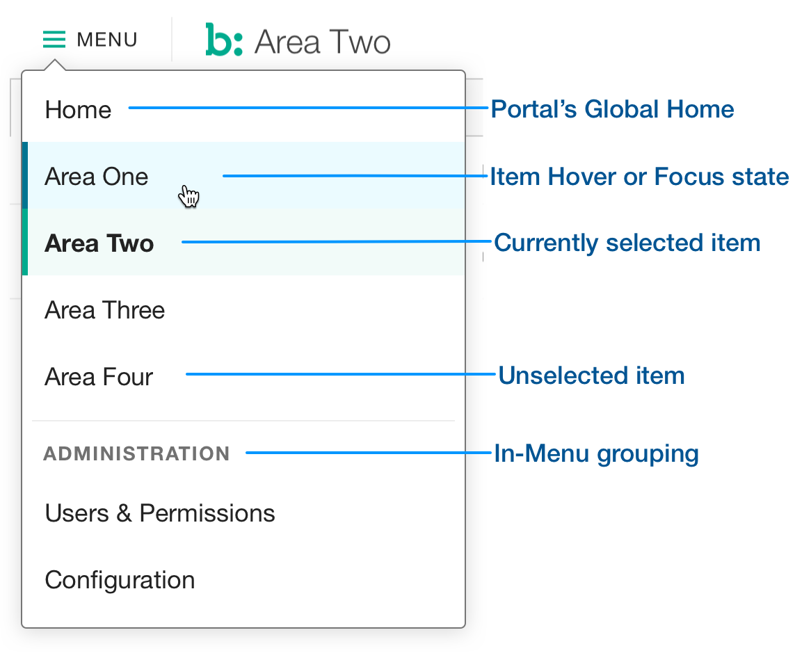

## Description
Primary Navigation items make up the highest level of Navigation in [Console Header](../), and under which (conceptually) nest the [Secondary Navigation](../secondary-nav) items. Primary Navigation items are contained in a Menu Flyout, triggered by the  **≡ MENU**  button.

## Example

## Usage
* Primary navigation menu never displays automatically, nor is triggered by any button, action, or object, other than the button it is visually connected to.
* Items may be grouped with descriptive labels in the menu.
* Items containing data and tools only for Bazaarvoice employees use an Internal-Only style.
* Only navigational items are allowed in the Menu. No workflow actions (creative or destructive), additional flyout menus, or Console-external navigation should be added to the Menu. 
* Items should not repeat. If two Users need to use similar tools, they should live under the same items, ideally using the same tool or sections, modified where appropriate by rights and permissions.
* Navigation items should avoid using the following terms:
    * Explorer, Navigator, Manager
    * UI
    * Admin
    * Hub
    * Non-standard acronyms (acceptable examples: FAQ, API, SDK)
    * Any reference to the project name, codebase/repo name, codename, or other internal naming 