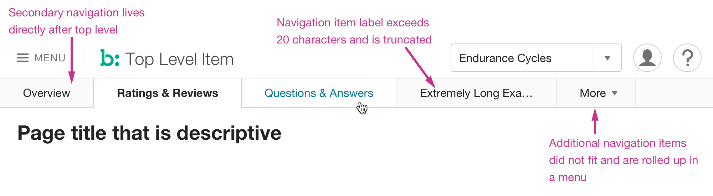

## Description
Secondary navigation is the row of navigational items displayed after the Top Bar in [Page Header](../header).

## Example

## Usage
* Secondary Navigation is always shown, even if there is only a single secondary item.
* Items containing data and tools only for Bazaarvoice employees display in internal-only style.
* Number of items displayed to a user should be 7 or less (see Miller's Law⁠[^1])
* Only navigational items are allowed in the Secondary Navigation; no workflow actions or buttons.
* Keep item labels concise, ideally using only one word, though two are acceptable. Ampersands (&) do not count.
* Avoid the following terms:
    * Home (or any other item used in a higher level of navigation)
    * Explorer, Navigator, Manager
    * UI
    * Admin
    * Hub
    * Non-standard acronyms (acceptable examples: FAQ, API, SDK)
    * Any reference to the project name, codebase/repo name, codename, or other internal naming 
* Label text for items should be a term or object descriptive of the purpose or data therein.
* Label text for items over 20 characters will be automatically truncated.
* If all items do not fit in 1024 viewport, excess items will be rolled up under a More menu flyout automatically appended to the Secondary Navigation.

[^1]: https://lawsofux.com/millers-law.html