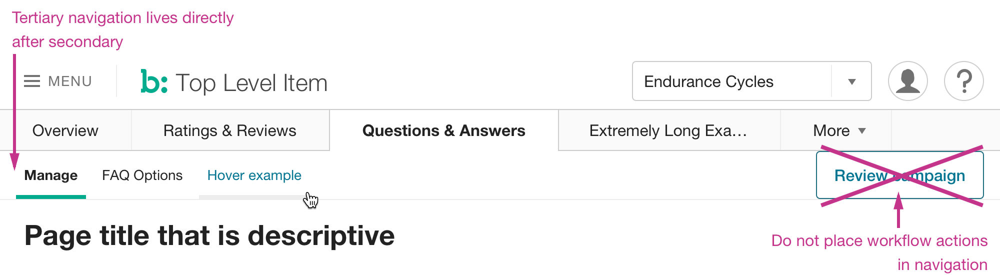

## Description
Secondary navigation is the row of navigational items displayed after the Top Bar in [Page Header](../).

## Example

## Usage
* Tertiary navigation is optional if there is only one item.
* Additional sub-pages inside the workflow do not necessarily require Tertiary Navigation items.
* Creative or destructive workflow actions should not be included (as items or other Elements).
* Follow rules for [Secondary Navigation](../secondary-nav) items.